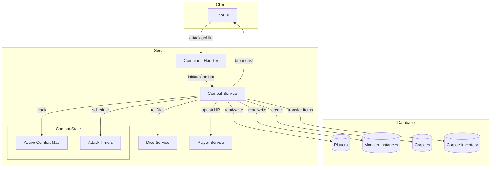
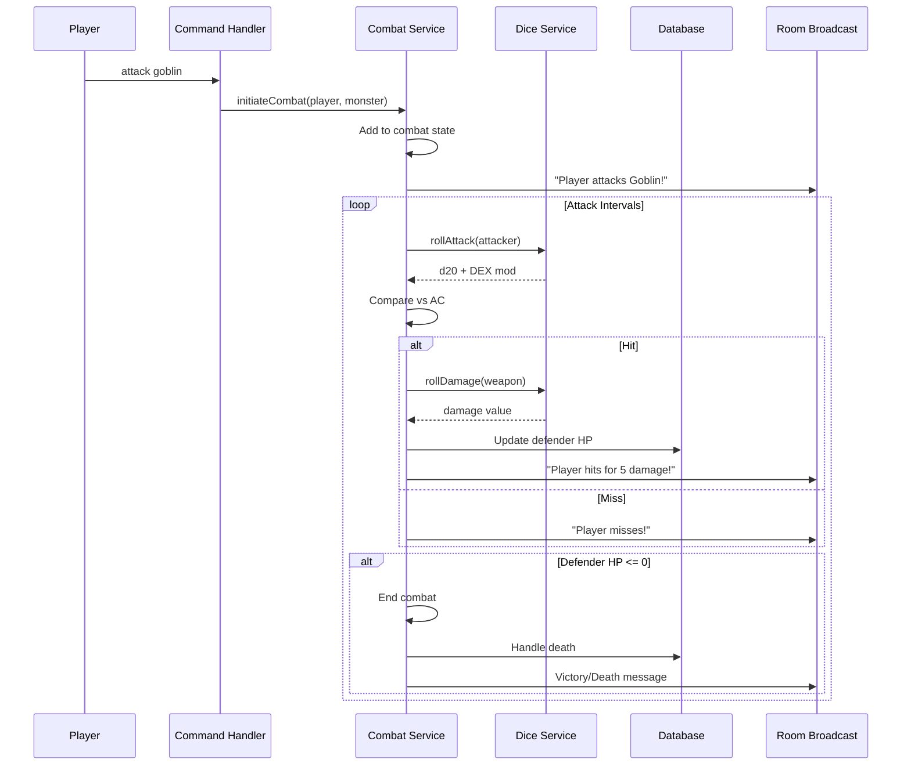

# Design Document: Combat System

## Overview

The combat system implements real-time, interval-based combat between players and monsters in the MUD game. Combat uses D&D-style mechanics with dice rolls, stat modifiers, and armor class calculations. The system runs server-side with automatic attack intervals determined by DEX scores, broadcasts combat events to room participants, and handles edge cases like fleeing, death, and disconnection.

Key design decisions:

- **Server-side combat loops**: All combat timing and resolution happens on the server to prevent cheating
- **Interval-based attacks**: Both players and monsters attack automatically at DEX-determined intervals
- **In-memory combat state**: Active combat tracked in memory for performance, with death/disconnect cleanup
- **Event-driven architecture**: Combat events broadcast via Socket.io to room participants

## Architecture



### Combat Flow



## Components and Interfaces

### DiceService

Handles all dice rolling and notation parsing.

```typescript
type DiceRoll = {
  count: number; // Number of dice (N in NdS)
  sides: number; // Die size (S in NdS)
  modifier: number; // Bonus/penalty (+M or -M)
};

type RollResult = {
  rolls: number[]; // Individual die results
  modifier: number; // Applied modifier
  total: number; // Sum of rolls + modifier
};

/**
 * Parse dice notation string into structured format
 * @param notation - Dice string like "1d6", "2d4+1", "1d8-2"
 * @returns Parsed dice roll or null if invalid
 */
function parseDiceNotation(notation: string): DiceRoll | null;

/**
 * Format a DiceRoll back to notation string
 * @param roll - Structured dice roll
 * @returns Notation string like "2d6+3"
 */
function formatDiceNotation(roll: DiceRoll): string;

/**
 * Execute a dice roll
 * @param roll - Dice roll specification
 * @returns Result with individual rolls and total
 */
function rollDice(roll: DiceRoll): RollResult;

/**
 * Convenience function to parse and roll in one step
 * @param notation - Dice notation string
 * @returns Roll result or null if invalid notation
 */
function roll(notation: string): RollResult | null;
```

### StatService

Handles stat modifier calculations.

```typescript
/**
 * Calculate D&D-style stat modifier
 * @param stat - Raw stat value (e.g., 10, 14, 8)
 * @returns Modifier value: floor((stat - 10) / 2)
 */
function getStatModifier(stat: number): number;

/**
 * Calculate AC for a combatant
 * @param dex - DEX stat value
 * @param equipmentConBonus - Total CON bonus from equipment
 * @returns AC value: 10 + DEX modifier + equipment CON bonus
 */
function calculateAC(dex: number, equipmentConBonus: number): number;

/**
 * Calculate attack interval in milliseconds
 * @param dex - DEX stat value
 * @returns Interval clamped between 1500ms and 5000ms
 */
function calculateAttackInterval(dex: number): number;
```

### CombatService

Core combat logic and state management.

```typescript
type CombatParticipant = {
  type: "player" | "monster";
  id: string;
  name: string;
  currentHp: number;
  maxHp: number;
  stats: { str: number; dex: number; con: number };
  weaponDamage: string | null; // null = unarmed
  ac: number;
  level: number;
};

type ActiveCombat = {
  odId: string;
  participants: Map<string, CombatParticipant>; // participantId -> participant
  monsterTargets: Map<string, Set<string>>; // monsterId -> Set<playerId>
  attackTimers: Map<string, NodeJS.Timeout>; // participantId -> timer
  roomId: string;
};

/**
 * Initiate combat between player and monster
 * @param playerId - Attacking player's ID
 * @param monsterInstanceId - Target monster instance ID
 * @returns Success/failure with message
 */
function initiateCombat(
  playerId: string,
  monsterInstanceId: string,
): Promise<CombatResult>;

/**
 * Process a single attack from attacker to defender
 * @param attackerId - ID of attacking participant
 * @param defenderId - ID of defending participant
 * @returns Attack result with hit/miss, damage, messages
 */
function processAttack(
  attackerId: string,
  defenderId: string,
): Promise<AttackResult>;

/**
 * Attempt to flee from combat
 * @param playerId - Fleeing player's ID
 * @returns Flee result with success/failure and destination
 */
function attemptFlee(playerId: string): Promise<FleeResult>;

/**
 * Handle player death
 * @param playerId - Dying player's ID
 * @param roomId - Room where death occurred
 */
function handlePlayerDeath(playerId: string, roomId: string): Promise<void>;

/**
 * Handle monster death
 * @param monsterInstanceId - Dying monster's ID
 * @param killerPlayerId - Player who dealt killing blow
 */
function handleMonsterDeath(
  monsterInstanceId: string,
  killerPlayerId: string,
): Promise<void>;

/**
 * End combat for a specific player
 * @param playerId - Player leaving combat
 */
function endCombatForPlayer(playerId: string): void;

/**
 * Check and trigger monster aggro when player enters room
 * @param playerId - Entering player's ID
 * @param roomId - Room being entered
 */
function checkMonsterAggro(playerId: string, roomId: string): Promise<void>;

/**
 * Handle player disconnect during combat
 * @param playerId - Disconnecting player's ID
 */
function handleDisconnect(playerId: string): Promise<void>;
```

### CorpseService

Handles corpse creation and management.

```typescript
type Corpse = {
  id: string;
  playerId: string; // Owner who can loot during lock period
  roomId: string;
  createdAt: Date;
  unlocksAt: Date; // 1 hour after creation
};

/**
 * Create a corpse for a dead player
 * @param playerId - Dead player's ID
 * @param roomId - Death location
 * @returns Created corpse
 */
function createCorpse(playerId: string, roomId: string): Promise<Corpse>;

/**
 * Transfer all player inventory to corpse
 * @param playerId - Player whose inventory to transfer
 * @param corpseId - Target corpse
 */
function transferInventoryToCorpse(
  playerId: string,
  corpseId: string,
): Promise<void>;

/**
 * Check if a player can loot a corpse
 * @param playerId - Player attempting to loot
 * @param corpseId - Target corpse
 * @returns Whether looting is allowed
 */
function canLootCorpse(playerId: string, corpseId: string): Promise<boolean>;
```

## Data Models

### Schema Additions

```typescript
// Add to monsters table
aggroScore: integer("aggro_score").notNull().default(0),

// New corpses table
export const corpses = sqliteTable("corpses", {
  id: text("id").primaryKey(),
  playerId: text("player_id")
    .notNull()
    .references(() => players.id),
  roomId: text("room_id")
    .notNull()
    .references(() => rooms.id),
  createdAt: integer("created_at", { mode: "timestamp" }).notNull(),
  unlocksAt: integer("unlocks_at", { mode: "timestamp" }).notNull(),
});

// New corpseInventory table
export const corpseInventory = sqliteTable("corpse_inventory", {
  id: text("id").primaryKey(),
  corpseId: text("corpse_id")
    .notNull()
    .references(() => corpses.id),
  itemId: text("item_id")
    .notNull()
    .references(() => items.id),
  quantity: integer("quantity").notNull().default(1),
});

// Add respawn point to players table
respawnRoomId: text("respawn_room_id"),
```

### In-Memory Combat State

```typescript
// Global combat state (not persisted)
const activeCombats: Map<string, ActiveCombat> = new Map();

// Player to combat mapping for quick lookup
const playerCombatMap: Map<string, string> = new Map(); // playerId -> combatId

// Monster to combat mapping
const monsterCombatMap: Map<string, string> = new Map(); // monsterInstanceId -> combatId
```

### Type Definitions

```typescript
type AttackResult = {
  hit: boolean;
  attackRoll: number;
  targetAC: number;
  damage: number | null; // null if miss
  defenderHp: number; // HP after damage
  defenderDead: boolean;
  message: string; // Formatted combat message
};

type FleeResult = {
  success: boolean;
  message: string;
  destination: string | null; // Room ID if successful
};

type CombatResult = {
  success: boolean;
  message: string;
  combatId: string | null;
};
```

## Correctness Properties

_A property is a characteristic or behavior that should hold true across all valid executions of a system—essentially, a formal statement about what the system should do. Properties serve as the bridge between human-readable specifications and machine-verifiable correctness guarantees._

### Property 1: Stat Modifier Calculation

_For any_ stat value, the stat modifier SHALL equal floor((stat - 10) / 2).

**Validates: Requirements 10.1, 10.2, 10.3, 10.4**

### Property 2: Attack Interval Calculation

_For any_ DEX stat value, the attack interval SHALL equal max(1500, min(5000, 3000 - (getStatModifier(dex) \* 200))) milliseconds.

**Validates: Requirements 2.1, 2.2, 2.3**

### Property 3: AC Calculation

_For any_ DEX stat value and equipment CON bonus, the AC SHALL equal 10 + getStatModifier(dex) + equipmentConBonus.

**Validates: Requirements 3.2**

### Property 4: Hit Determination

_For any_ attack roll and defender AC, the attack is a hit if and only if attackRoll >= defenderAC.

**Validates: Requirements 3.3, 3.4**

### Property 5: Damage Bounds

_For any_ successful hit with a weapon dealing "NdS+M" damage and attacker STR modifier, the damage SHALL be at least 1 and at most (N \* S) + M + strModifier.

**Validates: Requirements 3.5, 3.6, 3.7**

### Property 6: HP Reduction

_For any_ damage dealt to a defender, the defender's new HP SHALL equal their previous HP minus the damage dealt.

**Validates: Requirements 3.8**

### Property 7: Flee DC Calculation

_For any_ player level and monster level, the flee DC SHALL equal 10 + (monsterLevel - playerLevel) \* 2.

**Validates: Requirements 4.2**

### Property 8: Death Trigger

_For any_ combatant (player or monster), death SHALL be triggered if and only if their HP is 0 or below.

**Validates: Requirements 5.1, 6.1**

### Property 9: XP Penalty Calculation

_For any_ player XP value, the XP after death penalty SHALL equal max(0, xp - floor(xp \* 0.1)).

**Validates: Requirements 5.3**

### Property 10: Inventory Transfer Completeness

_For any_ player who dies, all items in their inventory SHALL appear in their corpse inventory with the same quantities.

**Validates: Requirements 5.5**

### Property 11: Corpse Access Control

_For any_ corpse, if current time < unlocksAt, only the owning player can retrieve items; if current time >= unlocksAt, any player can retrieve items.

**Validates: Requirements 5.6, 5.7, 5.8**

### Property 12: XP Award

_For any_ monster killed by a player, the player's XP SHALL increase by exactly the monster's xpReward value.

**Validates: Requirements 6.3**

### Property 13: Aggro Trigger

_For any_ monster with aggroScore > 0 and any player with level <= aggroScore, the monster SHALL initiate combat with that player.

**Validates: Requirements 7.3**

### Property 14: Dice Notation Parsing

_For any_ valid dice notation string matching pattern /^\d+d\d+([+-]\d+)?$/, parsing SHALL succeed and produce a DiceRoll with correct count, sides, and modifier.

**Validates: Requirements 9.1, 9.2**

### Property 15: Dice Roll Bounds

_For any_ dice roll of NdS+M, each individual die result SHALL be in range [1, S], and the total SHALL be in range [N + M, N*S + M].

**Validates: Requirements 9.3, 9.4**

### Property 16: Dice Notation Round-Trip

_For any_ valid DiceRoll object, formatting to notation string then parsing back SHALL produce an equivalent DiceRoll.

**Validates: Requirements 9.5, 9.6**

## Error Handling

### Invalid Targets

- Attack command with non-existent monster: Return "You don't see [target] here."
- Attack command with no target specified: Return "Attack what?"
- Attack command targeting a player: Return "You cannot attack other players." (PvP not in MVP)

### Combat State Errors

- Flee when not in combat: Return "You're not in combat."
- Attack when already fighting same target: Return "You're already fighting [target]!"
- Combat action after death: Ignore and let respawn complete first

### Dice Parsing Errors

- Invalid dice notation: Return null from parser, caller handles gracefully
- Negative dice count or sides: Reject as invalid notation

### Database Errors

- Failed to create corpse: Log error, still respawn player (items lost)
- Failed to transfer inventory: Log error, continue with partial transfer
- Failed to update HP: Retry once, then log and continue

### Disconnect Handling

- Player disconnects mid-combat: Trigger death sequence immediately
- Socket reconnect during death processing: Queue reconnect until death complete

## Testing Strategy

### Unit Tests

Unit tests focus on specific examples, edge cases, and error conditions:

- Stat modifier edge cases: stat=1 (mod=-5), stat=10 (mod=0), stat=11 (mod=0), stat=20 (mod=+5)
- Attack interval edge cases: very low DEX (clamped to 5000ms), very high DEX (clamped to 1500ms)
- Dice parsing edge cases: "1d6", "2d4+1", "1d8-2", invalid strings like "d6", "1d", "abc"
- AC calculation with zero equipment bonus
- Damage minimum enforcement when STR modifier is negative
- XP penalty when XP is 0 (should stay 0)
- Corpse unlock timing boundary (exactly 1 hour)

### Property-Based Tests

Property tests use the `fast-check` library with minimum 20 iterations per test (per coding standards).

Each property test references its design document property with format:
**Feature: combat-system, Property N: [property description]**

Property tests to implement:

1. Stat modifier formula (Property 1)
2. Attack interval with clamping (Property 2)
3. AC calculation (Property 3)
4. Hit determination (Property 4)
5. Damage bounds (Property 5)
6. HP reduction (Property 6)
7. Flee DC calculation (Property 7)
8. Death trigger condition (Property 8)
9. XP penalty calculation (Property 9)
10. Corpse access control (Property 11)
11. XP award (Property 12)
12. Aggro trigger (Property 13)
13. Dice notation parsing (Property 14)
14. Dice roll bounds (Property 15)
15. Dice notation round-trip (Property 16)

Note: Property 10 (inventory transfer completeness) is better tested as an integration test since it involves database operations.

### Test File Organization

Per coding standards:

- Unit tests: `tests/unit/combat.test.ts`, `tests/unit/dice.test.ts`
- Property tests: `tests/property/combat.property.test.ts`, `tests/property/dice.property.test.ts`
- Generators: `tests/generators/combat.generator.ts` (for generating valid stats, dice notations, combat scenarios)

### Generator Naming

Per coding standards, generators use `Arb` suffix:

- `statValueArb` - generates valid stat values (1-30)
- `diceNotationArb` - generates valid dice notation strings
- `diceRollArb` - generates valid DiceRoll objects
- `combatantArb` - generates valid combatant objects with stats
- `levelArb` - generates valid player/monster levels (1-20)
