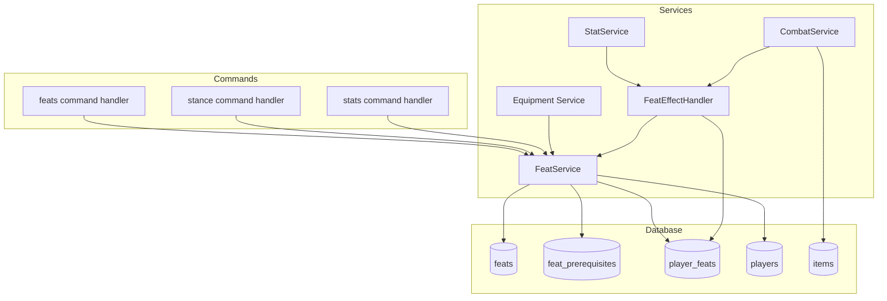

# Design Document: Feats System

## Overview

The Feats System adds Pathfinder-style character customization to the MUD game. Players gain feat slots at level 2 and every even level thereafter, allowing them to acquire special abilities that modify combat mechanics, stats, and equipment options.

For v1, the system implements 6 starter feats (Toughness, Dodge, Combat Expertise, Power Attack, Deadly Aim, Two-Weapon Fighting) while seeding the full ~1400 feat library from CSV with supportability tagging for future expansion.

### Key Design Decisions

1. **Hardcoded Effects for v1**: Rather than a generic effect system, each v1 feat has hardcoded logic in the effect handler. This keeps complexity low while we validate the core mechanics.

2. **Stance System**: Stance feats (Combat Expertise, Power Attack, Deadly Aim) use an `active_stance` column on the players table that stores the feat_id of the active stance (or null). Only one stance can be active at a time.

3. **BAB Calculation**: Base Attack Bonus is derived from level: `BAB = floor(level / 3)`. This means BAB +1 requires level 3, BAB +2 requires level 6, etc.

4. **Weapon Range**: Items have a `weaponRange` field ("melee" | "ranged") to distinguish weapon types for Power Attack vs Deadly Aim.

5. **Prerequisite Parsing**: Prerequisites are parsed at seed time and stored in a normalized `feat_prerequisites` table. Original text is preserved for display.

6. **Supportability Tagging**: Feats are tagged as `supported`, `unsupported`, or `partially_supported` based on whether their prerequisites can be evaluated by current game systems.

## Architecture



### Data Flow

1. **Feat Acquisition**: Command → FeatService.acquireFeat() → prerequisite check → decrement slots → create player_feats record
2. **HP Calculation**: StatService.calculateMaxHp() → FeatEffectHandler.getToughnessBonus() → return modified HP
3. **AC Calculation**: StatService.calculateAC() → FeatEffectHandler.getACModifiers() → return modified AC
4. **Attack Resolution**: CombatService.processAttack() → FeatEffectHandler.getAttackModifiers() + getStanceModifiers() → apply to roll/damage
5. **Equipment Validation**: equipItem() → FeatService.hasFeat("Two-Weapon Fighting") → allow/reject dual wield
6. **Stance Toggle**: stance command → FeatService.setActiveStance() → update players.active_stance
7. **Stats Display**: stats command → FeatService.getActiveStance() → show stance name and hint

## Components and Interfaces

### FeatService (`src/services/FeatService.ts`)

```typescript
/**
 * Core feat management service.
 * Handles feat queries, prerequisite checking, and acquisition.
 */

/** Prerequisite check result */
type PrerequisiteResult = {
  met: boolean;
  unmetRequirements: string[];
};

/** Feat acquisition result */
type AcquireFeatResult = {
  success: boolean;
  message: string;
};

/**
 * Get all feats a player has acquired.
 * @param playerId - The player's ID
 * @returns Array of feat records with name and description
 */
export async function getPlayerFeats(playerId: string): Promise<Feat[]>;

/**
 * Get feats available for a player to acquire.
 * Filters by: supported status, not already owned, prerequisites met.
 * @param playerId - The player's ID
 * @returns Array of acquirable feats
 */
export async function getAvailableFeats(playerId: string): Promise<Feat[]>;

/**
 * Get feat details by name (case-insensitive fuzzy match).
 * @param featName - The feat name to search
 * @returns Feat record or null if not found
 */
export async function getFeatByName(featName: string): Promise<Feat | null>;

/**
 * Check if a player meets all prerequisites for a feat.
 * @param playerId - The player's ID
 * @param featId - The feat's ID
 * @returns Result with met status and list of unmet requirements
 */
export async function checkPrerequisites(
  playerId: string,
  featId: string,
): Promise<PrerequisiteResult>;

/**
 * Attempt to acquire a feat for a player.
 * Validates: has slots, meets prerequisites, doesn't already have it.
 * @param playerId - The player's ID
 * @param featId - The feat's ID
 * @returns Result with success status and message
 */
export async function acquireFeat(
  playerId: string,
  featId: string,
): Promise<AcquireFeatResult>;

/**
 * Check if a player has a specific feat.
 * @param playerId - The player's ID
 * @param featName - The feat name (case-insensitive)
 * @returns True if player has the feat
 */
export async function hasFeat(
  playerId: string,
  featName: string,
): Promise<boolean>;

/**
 * Get feats filtered by category.
 * @param category - Category name (e.g., "Combat", "Teamwork")
 * @param supportedOnly - If true, only return supported feats
 * @returns Array of feats in the category
 */
export async function getFeatsByCategory(
  category: string,
  supportedOnly?: boolean,
): Promise<Feat[]>;

/**
 * Get all unique feat categories.
 * @returns Array of category names with feat counts
 */
export async function getCategories(): Promise<
  Array<{ name: string; count: number }>
>;

/**
 * Set the active stance for a player.
 * @param playerId - The player's ID
 * @param featId - The stance feat's ID, or null to deactivate
 * @returns Result with success status and message
 */
export async function setActiveStance(
  playerId: string,
  featId: string | null,
): Promise<{ success: boolean; message: string }>;

/**
 * Get the active stance for a player.
 * @param playerId - The player's ID
 * @returns The active stance feat, or null if no stance is active
 */
export async function getActiveStance(playerId: string): Promise<Feat | null>;

/**
 * Check if a feat is a stance feat.
 * @param featId - The feat's ID
 * @returns True if the feat is a stance feat
 */
export async function isStanceFeat(featId: string): Promise<boolean>;

/**
 * Calculate BAB from player level.
 * Formula: BAB = floor(level / 3)
 * @param level - The player's level
 * @returns The player's BAB
 */
export function calculateBAB(level: number): number;

/**
 * Grant a feat slot to a player (called on level-up to even levels).
 * @param playerId - The player's ID
 */
export async function grantFeatSlot(playerId: string): Promise<void>;
```

### FeatEffectHandler (`src/services/FeatEffectHandler.ts`)

```typescript
/**
 * Applies feat effects to game mechanics.
 * Hardcoded logic for v1 feats.
 */

/** AC modifier from feats */
type ACModifier = {
  dodge: number; // From Dodge feat
  stance: number; // From Combat Expertise stance (when active)
};

/** Attack modifier from feats */
type AttackModifier = {
  stance: number; // From any active stance (-1 for all stance feats)
};

/** Damage modifier from feats */
type DamageModifier = {
  stance: number; // From Power Attack or Deadly Aim (when active and weapon matches)
};

/** Weapon range type */
type WeaponRange = "melee" | "ranged";

/**
 * Calculate Toughness HP bonus for a player.
 * Formula: +3 HP, +1 HP per level beyond 3rd
 * @param playerId - The player's ID
 * @param level - The player's current level
 * @returns HP bonus (0 if player doesn't have Toughness)
 */
export async function getToughnessBonus(
  playerId: string,
  level: number,
): Promise<number>;

/**
 * Get AC modifiers from feats for a player.
 * @param playerId - The player's ID
 * @returns AC modifiers from Dodge and active stance
 */
export async function getACModifiers(playerId: string): Promise<ACModifier>;

/**
 * Get attack modifiers from feats for a player.
 * @param playerId - The player's ID
 * @returns Attack modifiers from active stance
 */
export async function getAttackModifiers(
  playerId: string,
): Promise<AttackModifier>;

/**
 * Get damage modifiers from feats for a player.
 * @param playerId - The player's ID
 * @param weaponRange - The range of the weapon being used
 * @returns Damage modifiers from Power Attack or Deadly Aim
 */
export async function getDamageModifiers(
  playerId: string,
  weaponRange: WeaponRange,
): Promise<DamageModifier>;

/**
 * Check if a player can dual wield (has Two-Weapon Fighting).
 * @param playerId - The player's ID
 * @returns True if player can equip weapons in both hands
 */
export async function canDualWield(playerId: string): Promise<boolean>;
```

### Prerequisite Parser (`src/services/feats/prerequisiteParser.ts`)

```typescript
/**
 * Parses prerequisite text into structured data.
 */

type ParsedPrerequisite =
  | {
      type: "stat";
      key: "str" | "dex" | "con" | "int" | "wis" | "cha";
      value: number;
    }
  | { type: "level"; key: null; value: number }
  | { type: "bab"; key: null; value: number } // BAB requirement (converted to level: value * 3)
  | { type: "feat"; key: string; value: null } // key is feat name
  | { type: "unsupported"; key: string; value: null }; // key is original text

type ParseResult = {
  prerequisites: ParsedPrerequisite[];
  supportability: "supported" | "unsupported" | "partially_supported";
};

/**
 * Parse prerequisite text into structured prerequisites.
 * Supported patterns:
 * - Stat: "Str 13", "Dex 15", etc.
 * - Level: "level 5", "character level 10"
 * - BAB: "base attack bonus +1" (converted to level requirement: BAB * 3)
 * - Feat: matches against known feat names
 * @param text - Raw prerequisite text from CSV
 * @param knownFeatNames - Set of feat names for feat prerequisite matching
 * @returns Parsed prerequisites and supportability status
 */
export function parsePrerequisites(
  text: string,
  knownFeatNames: Set<string>,
): ParseResult;

/**
 * Scale a Pathfinder level to game level.
 * Formula: ourLevel = Math.round(pfLevel * (1 + pfLevel * 0.1))
 * @param pfLevel - Pathfinder level (1-20)
 * @returns Scaled game level
 */
export function scaleLevel(pfLevel: number): number;

/**
 * Convert BAB requirement to level requirement.
 * Formula: requiredLevel = babValue * 3
 * @param bab - Required BAB value
 * @returns Required level
 */
export function babToLevel(bab: number): number;
```

## Data Models

### Database Schema

```typescript
// feats table
export const feats = sqliteTable("feats", {
  id: text("id").primaryKey(),
  name: text("name").notNull().unique(),
  prerequisitesText: text("prerequisites_text"), // Original text for display
  shortDescription: text("short_description").notNull(),
  longDescription: text("long_description"),
  sourceBook: text("source_book"),
  category: text("category").notNull().default("Untyped"),
  effectType: text("effect_type"), // hp_bonus, ac_bonus, combat_stance, equipment_unlock
  supportabilityStatus: text("supportability_status")
    .notNull()
    .default("unsupported"),
});

// feat_prerequisites table (normalized prerequisite data)
export const featPrerequisites = sqliteTable("feat_prerequisites", {
  id: text("id").primaryKey(),
  featId: text("feat_id")
    .notNull()
    .references(() => feats.id, { onDelete: "cascade" }),
  prerequisiteType: text("prerequisite_type").notNull(), // stat, level, feat, unsupported
  prerequisiteKey: text("prerequisite_key"), // stat name, feat name, or original text
  prerequisiteValue: integer("prerequisite_value"), // minimum value for stat/level
});

// player_feats table (many-to-many)
export const playerFeats = sqliteTable(
  "player_feats",
  {
    id: text("id").primaryKey(),
    playerId: text("player_id")
      .notNull()
      .references(() => players.id),
    featId: text("feat_id")
      .notNull()
      .references(() => feats.id, { onDelete: "cascade" }),
    acquiredAt: integer("acquired_at", { mode: "timestamp" }).notNull(),
  },
  (table) => ({
    uniquePlayerFeat: unique().on(table.playerId, table.featId),
  }),
);

// Add to players table
// unspentFeatSlots: integer("unspent_feat_slots").notNull().default(0),
// activeStance: text("active_stance").references(() => feats.id), // Currently active stance feat, or null

// Add to items table
// weaponRange: text("weapon_range"), // "melee" or "ranged" for weapons
```

### Type Definitions

```typescript
// src/types/feat.ts

export type Feat = {
  id: string;
  name: string;
  prerequisitesText: string | null;
  shortDescription: string;
  longDescription: string | null;
  sourceBook: string | null;
  category: string;
  effectType: string | null;
  supportabilityStatus: "supported" | "unsupported" | "partially_supported";
};

export type FeatPrerequisite = {
  id: string;
  featId: string;
  prerequisiteType: "stat" | "level" | "bab" | "feat" | "unsupported";
  prerequisiteKey: string | null;
  prerequisiteValue: number | null;
};

export type PlayerFeat = {
  id: string;
  playerId: string;
  featId: string;
  acquiredAt: Date;
};

export type WeaponRange = "melee" | "ranged";
```

## Correctness Properties

_A property is a characteristic or behavior that should hold true across all valid executions of a system—essentially, a formal statement about what the system should do. Properties serve as the bridge between human-readable specifications and machine-verifiable correctness guarantees._

### Property 1: Level Scaling Formula

_For any_ Pathfinder level between 1 and 20, the scaled game level should equal `Math.round(pfLevel * (1 + pfLevel * 0.1))`.

**Validates: Requirements 2.4**

### Property 2: Prerequisite Parsing Round-Trip

_For any_ valid prerequisite string containing only supported prerequisite types (stats, levels, feats), parsing the string and then formatting the parsed result back to text should produce a semantically equivalent description.

**Validates: Requirements 2.9**

### Property 3: Prerequisite Evaluation

_For any_ player with a given set of stats, level, and acquired feats, and _for any_ feat with prerequisites, the prerequisite checker should correctly determine whether each requirement is met and return all unmet requirements.

**Validates: Requirements 3.1, 3.2, 3.3, 3.4**

### Property 4: Unsupported Feat Handling

_For any_ feat with supportability_status of "unsupported" or "partially_supported", the prerequisite checker should indicate the feat is not yet available without attempting to evaluate prerequisites.

**Validates: Requirements 3.5, 3.6**

### Property 5: Even Level Feat Slot Grant

_For any_ even level (2, 4, 6, 8, ...), when a player levels up to that level, they should receive exactly 1 additional unspent feat slot.

**Validates: Requirements 4.2, 4.3**

### Property 6: Feat Acquisition Invariants

_For any_ successful feat acquisition, the player's unspent_feat_slots should decrement by exactly 1, and a player_feats record should be created with a timestamp within 1 second of the current time.

**Validates: Requirements 4.5, 4.7**

### Property 7: Zero Slots Rejection

_For any_ player with 0 unspent_feat_slots, attempting to acquire any feat should be rejected with an appropriate message, and no player_feats record should be created.

**Validates: Requirements 4.6**

### Property 8: Unique Player-Feat Constraint

_For any_ player and feat combination, attempting to insert a duplicate player_feats record should be rejected by the database constraint.

**Validates: Requirements 1.3**

### Property 9: Cascade Delete

_For any_ feat with associated feat_prerequisites and player_feats records, deleting the feat should also delete all related records in both tables.

**Validates: Requirements 1.5**

### Property 10: Toughness HP Bonus

_For any_ player with the Toughness feat at level L, the HP bonus should equal `3 + max(0, L - 3)` (i.e., +3 HP plus +1 HP per level beyond 3rd).

**Validates: Requirements 6.2**

### Property 11: Dodge AC Bonus

_For any_ player with the Dodge feat, their calculated AC should be exactly 1 higher than it would be without the feat (all other factors being equal).

**Validates: Requirements 6.3**

### Property 12: Combat Expertise Stance Effects

_For any_ player with Combat Expertise as their active stance, their attack rolls should have a -1 modifier and their AC should have a +1 modifier compared to when no stance is active.

**Validates: Requirements 8.1**

### Property 13: Power Attack Stance Effects

_For any_ player with Power Attack as their active stance attacking with a melee weapon, their attack rolls should have a -1 modifier and their damage should have a +2 modifier. When attacking with a ranged weapon, no modifiers should apply.

**Validates: Requirements 8.2, 8.4**

### Property 14: Deadly Aim Stance Effects

_For any_ player with Deadly Aim as their active stance attacking with a ranged weapon, their attack rolls should have a -1 modifier and their damage should have a +2 modifier. When attacking with a melee weapon, no modifiers should apply.

**Validates: Requirements 8.3, 8.5**

### Property 15: Single Active Stance

_For any_ player, at most one stance can be active at a time. Activating a new stance should deactivate any previously active stance.

**Validates: Requirements 7.4**

### Property 16: BAB Calculation

_For any_ player level L, the BAB should equal `floor(L / 3)`.

**Validates: BAB system**

### Property 17: Two-Weapon Fighting Validation

_For any_ player attempting to equip a weapon in offHand while mainHand has a weapon, the action should succeed if and only if the player has the Two-Weapon Fighting feat.

**Validates: Requirements 9.1, 9.2**

### Property 18: Category Filtering

_For any_ category query, all returned feats should belong to the specified category.

**Validates: Requirements 10.3**

### Property 19: Available Feats Filtering

_For any_ player, the available feats list should contain only feats that are: (a) supported, (b) not already owned by the player, and (c) have all prerequisites met.

**Validates: Requirements 5.2**

### Property 20: Feat Slot Display

_For any_ feats command variation, the output should include the player's current unspent feat slots count.

**Validates: Requirements 5.6**

## Error Handling

### Feat Acquisition Errors

| Error Condition       | Message                                                              | Recovery                                 |
| --------------------- | -------------------------------------------------------------------- | ---------------------------------------- |
| No feat slots         | "You don't have any feat slots available. Gain more by leveling up." | Wait for level-up                        |
| Already has feat      | "You already have the {feat_name} feat."                             | None needed                              |
| Prerequisites not met | "You don't meet the prerequisites for {feat_name}: {unmet_list}"     | Improve stats/level/acquire prereq feats |
| Feat not found        | "No feat found matching '{input}'."                                  | Check spelling                           |
| Unsupported feat      | "{feat_name} is not yet available in the game."                      | Wait for future implementation           |

### Stance Errors

| Error Condition   | Message                                | Recovery         |
| ----------------- | -------------------------------------- | ---------------- |
| Don't have feat   | "You don't have the {feat_name} feat." | Acquire the feat |
| Not a stance feat | "{feat_name} is not a stance feat."    | Use correct feat |
| Already active    | "{feat_name} is already active."       | None needed      |
| No stance active  | "You don't have a stance active."      | None needed      |

### Equipment Errors

| Error Condition        | Message                                                        | Recovery         |
| ---------------------- | -------------------------------------------------------------- | ---------------- |
| Dual wield without TWF | "You need the Two-Weapon Fighting feat to dual wield weapons." | Acquire TWF feat |

## Testing Strategy

### Unit Tests

Unit tests focus on specific examples and edge cases:

1. **Prerequisite Parser**
   - Parse "Dex 13" → stat requirement
   - Parse "character level 5" → level requirement (scaled)
   - Parse "base attack bonus +1" → BAB requirement (converted to level 3)
   - Parse "Dodge" → feat requirement
   - Parse "Aberrant bloodline" → unsupported
   - Parse empty string → no prerequisites
   - Parse "Dex 15, Int 13" → multiple stat requirements
   - Parse "Str 13, base attack bonus +1" → stat + BAB requirements

2. **Level Scaling**
   - PF level 1 → game level 1
   - PF level 5 → game level 8
   - PF level 10 → game level 20
   - PF level 20 → game level 60

3. **BAB Calculation**
   - Level 1 → BAB 0
   - Level 3 → BAB 1
   - Level 6 → BAB 2
   - Level 9 → BAB 3

4. **Feat Effects**
   - Toughness at level 1 → +3 HP
   - Toughness at level 5 → +5 HP
   - Toughness at level 10 → +10 HP
   - Dodge → +1 AC
   - Combat Expertise active → -1 attack, +1 AC
   - Power Attack active with melee weapon → -1 attack, +2 damage
   - Power Attack active with ranged weapon → no modifiers
   - Deadly Aim active with ranged weapon → -1 attack, +2 damage
   - Deadly Aim active with melee weapon → no modifiers

5. **Command Parsing**
   - `feats` → list owned feats
   - `feats available` → list acquirable feats
   - `feats info Toughness` → show Toughness details
   - `feats acquire Dodge` → attempt acquisition
   - `feats category Combat` → filter by Combat category
   - `stance` → show current stance
   - `stance power attack` → activate Power Attack
   - `stance off` → deactivate stance

### Property-Based Tests

Property tests use fast-check with 20 iterations per test (per coding standards). Each test references its design property.

```typescript
// Example property test structure
describe("FeatService Properties", () => {
  // Feature: feats-system, Property 1: Level Scaling Formula
  it("scales Pathfinder levels correctly", () => {
    fc.assert(
      fc.property(fc.integer({ min: 1, max: 20 }), (pfLevel) => {
        const expected = Math.round(pfLevel * (1 + pfLevel * 0.1));
        const actual = scaleLevel(pfLevel);
        return actual === expected;
      }),
      { numRuns: 20 },
    );
  });

  // Feature: feats-system, Property 16: BAB Calculation
  it("calculates BAB correctly from level", () => {
    fc.assert(
      fc.property(fc.integer({ min: 1, max: 99 }), (level) => {
        const expected = Math.floor(level / 3);
        const actual = calculateBAB(level);
        return actual === expected;
      }),
      { numRuns: 20 },
    );
  });

  // Feature: feats-system, Property 3: Prerequisite Evaluation
  it("correctly evaluates all prerequisite types", () => {
    fc.assert(
      fc.property(
        playerStatsArb,
        prerequisiteArb,
        (playerStats, prerequisite) => {
          const result = evaluatePrerequisite(playerStats, prerequisite);
          // Verify result matches expected based on prerequisite type
          return verifyPrerequisiteResult(playerStats, prerequisite, result);
        },
      ),
      { numRuns: 20 },
    );
  });
});
```

### Test Generators (Arbitraries)

```typescript
// tests/generators/featGenerators.ts

/** Generate valid player stats (10-20 range) */
export const playerStatsArb = fc.record({
  str: fc.integer({ min: 10, max: 20 }),
  dex: fc.integer({ min: 10, max: 20 }),
  con: fc.integer({ min: 10, max: 20 }),
  int: fc.integer({ min: 10, max: 20 }),
  wis: fc.integer({ min: 10, max: 20 }),
  cha: fc.integer({ min: 10, max: 20 }),
  level: fc.integer({ min: 1, max: 99 }),
});

/** Generate stat prerequisite */
export const statPrerequisiteArb = fc.record({
  type: fc.constant("stat"),
  key: fc.constantFrom("str", "dex", "con", "int", "wis", "cha"),
  value: fc.integer({ min: 10, max: 20 }),
});

/** Generate level prerequisite */
export const levelPrerequisiteArb = fc.record({
  type: fc.constant("level"),
  key: fc.constant(null),
  value: fc.integer({ min: 1, max: 60 }),
});

/** Generate BAB prerequisite */
export const babPrerequisiteArb = fc.record({
  type: fc.constant("bab"),
  key: fc.constant(null),
  value: fc.integer({ min: 1, max: 20 }),
});

/** Generate any supported prerequisite */
export const prerequisiteArb = fc.oneof(
  statPrerequisiteArb,
  levelPrerequisiteArb,
  babPrerequisiteArb,
);

/** Generate even level for feat slot tests */
export const evenLevelArb = fc.integer({ min: 1, max: 49 }).map((n) => n * 2);

/** Generate weapon range */
export const weaponRangeArb = fc.constantFrom("melee", "ranged");
```

### Integration Tests

1. **Full Acquisition Flow**: Create player → level up to 2 → acquire Toughness → verify HP increased
2. **Combat with Feats**: Player with Dodge in combat → verify AC is +1 higher
3. **Stance Combat Effects**: Player with Power Attack active → attack with melee weapon → verify -1 attack, +2 damage
4. **Equipment with TWF**: Player with TWF → equip two weapons → verify both equipped
5. **Seeding**: Run seed → verify all 6 starter feats exist with correct data
6. **Stats Display**: Player with active stance → run stats command → verify stance shown with hint
